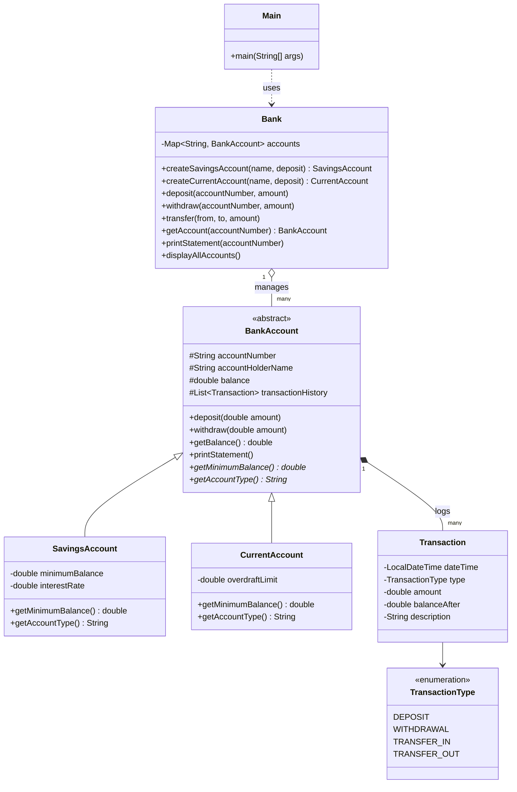

# Banking System Simulation

A Java console application simulating a simple bank: savings and current
accounts, deposits, withdrawals, transfers, transaction history, and
account statements — with business rules (minimum balance, overdraft
limits) enforced through the type hierarchy and validated at every entry
point.

## Features

- Open **Savings** accounts (minimum balance: 500.00) and **Current**
  accounts (overdraft limit: 1000.00)
- Deposit and withdraw funds, with positive-amount validation
- Transfer funds between any two accounts
- Full transaction history per account, with a printable statement
- Minimum balance / overdraft enforcement, and graceful handling of
  insufficient funds, invalid amounts, and unknown account numbers
- All accounts held in a `HashMap` inside a central `Bank` service, with
  auto-generated account numbers (`ACC1001`, `ACC1002`, ...)

## Project Structure

```
banking-system/
├── src/
│   └── com/banking/
│       ├── models/
│       │   ├── BankAccount.java              (abstract base class)
│       │   ├── SavingsAccount.java            (extends BankAccount)
│       │   ├── CurrentAccount.java            (extends BankAccount)
│       │   ├── Transaction.java
│       │   └── TransactionType.java           (enum)
│       ├── exceptions/
│       │   ├── InvalidAmountException.java
│       │   ├── InsufficientFundsException.java
│       │   ├── MinimumBalanceViolationException.java
│       │   └── AccountNotFoundException.java
│       ├── services/
│       │   └── Bank.java                      (owns all accounts, HashMap)
│       └── main/
│           ├── Main.java                      (interactive console menu)
│           └── Demo.java                      (scripted demo, no input needed)
└── README.md
```

## Design Notes

- **Inheritance / polymorphism**: `BankAccount` is abstract and holds all
  shared logic (deposit, withdraw, statement printing, transaction log).
  `SavingsAccount` and `CurrentAccount` only override `getMinimumBalance()`
  and `getAccountType()` — the withdrawal rule itself is written once, in
  the base class, and behaves differently per subclass purely through
  polymorphism.
- **Minimum balance vs. overdraft**: a savings account's minimum balance
  is a positive floor (500.00) it must stay above. A current account's
  "minimum balance" is expressed as a *negative* number
  (`-overdraftLimit`), so the exact same `withdraw()` check
  (`balanceAfter < getMinimumBalance()`) enforces both rules without any
  `if (accountType == ...)` branching.
- **Transfers** are implemented as a withdrawal on the source account
  followed by a deposit on the destination, both logged under
  `TRANSFER_OUT` / `TRANSFER_IN` so statements read clearly. If the debit
  succeeds but the credit somehow fails, the debit is rolled back.
- **Exceptions** are checked exceptions with specific types
  (`InvalidAmountException`, `InsufficientFundsException`,
  `MinimumBalanceViolationException`, `AccountNotFoundException`) so the
  console layer can catch them all and print a clean message instead of
  a stack trace, and so a caller could in principle handle each rule
  differently.

## UML Class Diagram



## Compiling and Running

Requires **Java 11 or later** (developed and tested against JDK 21).

### Compile

From the `banking-system/` directory:

```bash
javac -d out $(find src -name "*.java")
```

This compiles every source file into an `out/` directory, mirroring the
package structure.

### Run the interactive menu

```bash
java -cp out com.banking.main.Main
```

You'll get a numbered menu to open accounts, deposit, withdraw, transfer,
check balances, and print statements.

### Run the scripted demo (no input required)

```bash
java -cp out com.banking.main.Demo
```

This runs through account creation, a deposit, a withdrawal that dips
into overdraft, a transfer, and every required edge case (minimum
balance violation, overdraft exceeded, invalid amount, non-existent
account), then prints full statements for both accounts — useful as a
one-shot demonstration of the whole system.

## Sample Edge Cases Covered

| Scenario | Result |
|---|---|
| Withdraw more than a savings account's balance minus its minimum | `MinimumBalanceViolationException` |
| Withdraw beyond a current account's overdraft limit | `InsufficientFundsException` |
| Deposit or withdraw a negative/zero amount | `InvalidAmountException` |
| Operate on an account number that doesn't exist | `AccountNotFoundException` |
| Transfer to the same account | `InvalidAmountException` |
